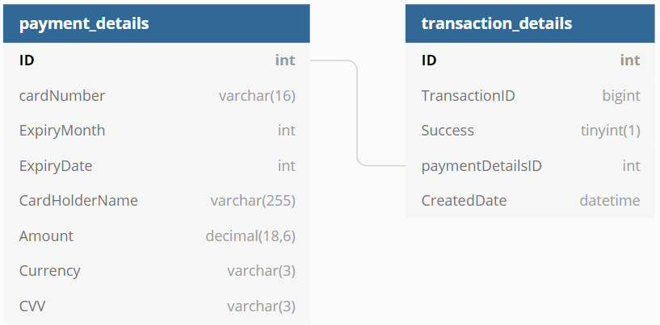

# PaymentGateway

### Run in Docker
* Run `docker-compose up -d`
* Test via http://localhost:9000/swagger/index.html or via tools like Postman

### Run Locally
* Have mysql running either locally or in docker
* Run SQL scripts in InitialiseDB folder to set up the user and required tables
* Spin up Elasticsearch & Kibana for logging - `docker-compose -f docker-compose-logging.yml up -d`
* Run the project and test it on https://localhost:5001/swagger/index.html or via tools like Postman

### Assumptions
* Payment request payload assumptions such as: 
    * A valid card number contains 16 digits
    * Currency is received in ISO Currency Code that always consists of 3 capital letters
* I am using random to generate transaction IDs from the simulated bank, there is a very small chance that this will end up with duplicated transaction ID; the assumption is that this transaction ID will always be unique from the real bank.

### Project Overview
* Upon receiving process payment request, the payment details are validated before storing it into payment_details table.  
  A request to the simulated bank is then made to process the payment, and the result of the transaction is stored into transaction_details table.  
  The status of the transaction and the transaction ID is provided as part of the response.  
  Transaction details can then be retrieved using a given transaction ID
  

* End points  
   * [POST] process payment - `api/v1/payment`
     
        Sample request payload
     
            {
                "cardNumber": "1234567812345678",
                "expiryMonth": 8,
                "expiryDate": 23,
                "cardHolderName": "K Li",
                "amount": 187.33,
                "currency": "GBP",
                "cvv": "777"
            }

        Sample Responses: Status Code `201` 
        
            {
                "status": "Success",
                "transactionID": 1879946082
            }
    
    * [GET] get transaction - `api/v1/transaction/{transactionId}`

        Sample Response:
        Status Code `200`
        
            {
                "cardNumber": "12345******45678",
                "cardHolderName": "K Li",
                "amount": 187.33,
                "currency": "GBP",
                "success": true,
                "createdDate": "2021-01-01T00:00:00"
            }

        Status Code `404`
      
        Transaction not found by Id
    

* Used FluentValidation for request validation
* Used AutoMapper for model mappings

### DB structure

### Areas for Improvements
* Add API authentication with API key
* Validate every properties on the incoming request
* Collect metrics with tools like Prometheus
* API integration tests
* Improve Swagger UI

